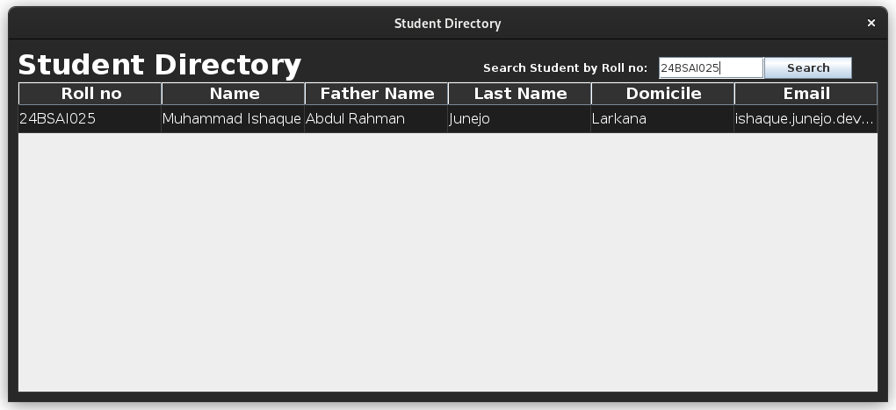

# Student-Database

This is a Java Application that shows a directory of Students from a given database. It uses **Swing** library for Graphical User Interface, and **JDBC Driver** (Java-Database Connection Driver) for accessing the **MySQL Database**.

It displays the Student Information as **Roll No**, **Name**, **Father Name**, **Last Name**, **Domicile**, **Email**.

This project was made as our Second Semester Project in Bachelors of Science in Artificial Intelligence from **MUET** (Mehran University of Engineering and Technology), Jamshoro.

### Team
- [Syed Muhammad Irtaza](https://github.com/syedirtaza10/)
- [Muhammad Ishaque Junejo](https://github.com/IshaqJunejo)

### Screenshots

**Screenshot of Application displaying Irtaza's Information**

**Screenshot of Application displaying Ishaque's Information**

### How to use

- Download the `mysql-connector-java` `.jar` file from the [Official Site](https://dev.mysql.com/downloads/connector/j/). 
- Add the `.jar` file to your project’s classpath.
- You can connect to your MySQL Database by changing the `URL`, `USER`, and `PASSWORD` in `DBConnection.java` file.
- And it's Good to Go, just Compile and Run.